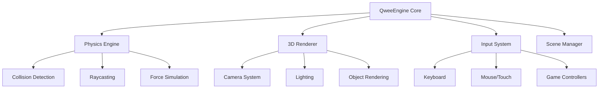
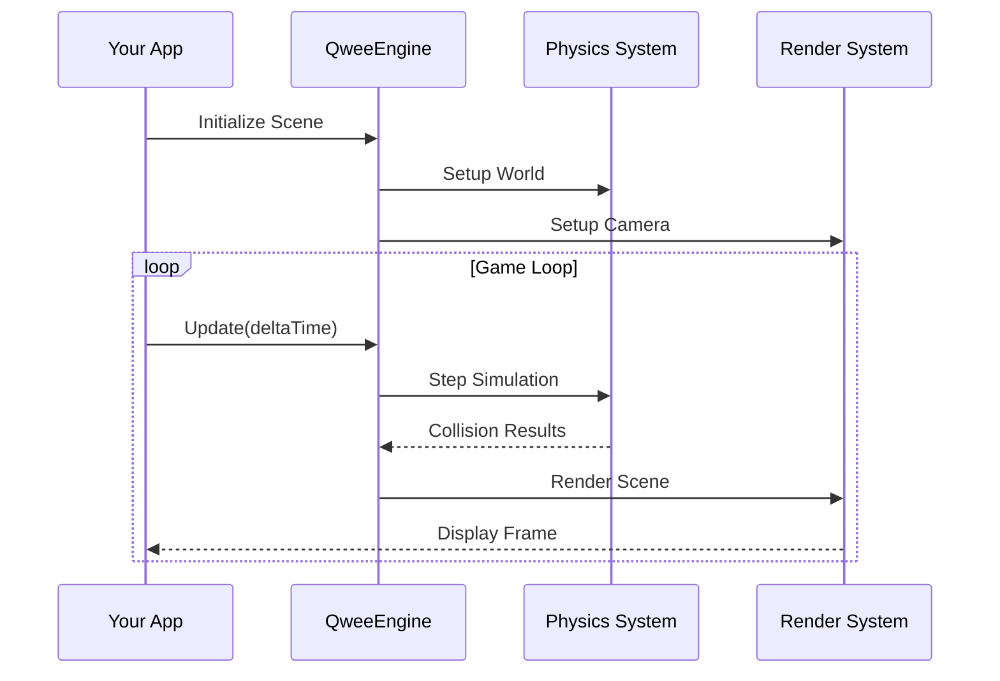

# QweeEngine

A modern, lightweight 3D game engine built natively for Apple platforms with cross-platform support capabilities.


## 🚀 Overview

**QweeEngine** is a powerful, native 3D game engine specifically designed for Apple platforms while maintaining cross-platform compatibility. Built with Swift and optimized for Apple silicon, it provides developers with tools to create stunning 3D applications and games with minimal overhead.



## ✨ Features

### 🎮 **Core Engine**
- **High-performance 3D rendering** with custom SwiftUI-based renderer
- **Physics simulation** with collision detection, raycasting, and force application
- **Real-time camera system** with multiple modes (FreeLook, FirstPerson, Orbit, ThirdPerson)
- **Input management** supporting keyboard, mouse, and touch controls

### 🏗️ **Physics System**
```
╔══════════════════════════════════════╗
║      Physics Engine Components       ║
╠══════════════════════════════════════╣
║ • Rigid Body Dynamics                ║
║ • Collision Shapes (Box, Sphere, etc)║
║ • Material Properties                ║
║ • Spatial Partitioning              ║
║ • Raycasting                        ║
║ • Sleeping/Awake System             ║
╚══════════════════════════════════════╝
```

### 🎨 **Graphics & Rendering**
- **Custom 3D object pipeline** with vertex-based rendering
- **Multiple camera projections** (Perspective & Orthographic)
- **Basic lighting system** with ambient and diffuse lighting
- **Wireframe and solid rendering** modes
- **Z-buffering** via painter's algorithm

### 🔧 **Development Tools**
- **Physics Debug View** with real-time statistics
- **Object Factory** for common 3D primitives
- **Shader management** system
- **Scene management** with object hierarchies

## 📋 System Requirements

### Minimum Requirements
- **macOS**: 13.0+ (Ventura)
- **iOS**: 16.0+
- **Xcode**: 15.0+
- **Swift**: 5.9+

### Recommended
- **Processor**: Apple Silicon (M1 or later)
- **RAM**: 8GB minimum, 16GB recommended
- **Graphics**: Metal-capable GPU

## 🛠️ Installation

### Using Xcode (Recommended)
1. **Clone the repository:**
   ```bash
   git clone https://github.com/yourusername/QweeEngine.git
   ```

2. **Open in Xcode:**
   ```bash
   cd QweeEngine
   open QweeEngine.xcodeproj
   ```

3. **Build the project:**
   - Select your target platform (macOS/iOS)
   - Press `Cmd + B` to build
   - Press `Cmd + R` to run the demo

### Project Structure
```
QweeEngine/
├── Core/
│   ├── PhysicsEngine.swift    # Physics simulation
│   ├── Camera.swift          # Camera system
│   └── InputManager.swift    # Input handling
├── Graphics/
│   ├── Polygon.swift         # 3D geometry
│   └── Shaders.swift         # Lighting system
├── Demo/
│   └── ContentView.swift     # Example implementation
└── Resources/
    └── Assets/              # Engine assets
```

## 🎯 Quick Start

### Creating Your First 3D Scene

```swift
import SwiftUI
import QweeEngine

struct MyGameScene: View {
    @StateObject private var physicsWorld = PhysicsWorld()
    @StateObject private var inputManager = InputManager()
    
    var body: some View {
        ZStack {
            // Your 3D content here
            PhysicsDebugView(world: physicsWorld)
        }
        .onAppear {
            setupScene()
        }
    }
    
    private func setupScene() {
        // Create a floor
        let floor = PhysicsBody(
            shape: .box(size: [50, 1, 50]),
            bodyType: .static
        )
        physicsWorld.addBody(floor)
        
        // Add a dynamic cube
        let cube = PhysicsBody(
            shape: .box(size: [2, 2, 2]),
            bodyType: .dynamic
        )
        cube.position = [0, 5, 0]
        physicsWorld.addBody(cube)
    }
}
```

## 📖 Documentation

### Engine Architecture



### Key Components

#### 1. **PhysicsWorld**
The central physics simulation manager:
```swift
let world = PhysicsWorld()
world.gravity = [0, -9.81, 0]
world.enabled = true

// Add physics bodies
world.addBody(physicsBody)

// Update physics
world.update(deltaTime: 1/60.0)
```

#### 2. **Camera System**
Multiple camera modes available:
```swift
let camera = Camera()
camera.mode = .firstPerson
camera.position = [0, 2, 10]
camera.lookAt(target: [0, 0, 0])

// Switch modes
camera.mode = .orbit
camera.setOrbitTarget([0, 0, 0])
```

#### 3. **3D Objects**
Create various 3D primitives:
```swift
let cube = ObjectFactory.createCube(size: 2.0, color: .red)
let sphere = ObjectFactory.createSphere(radius: 1.0)
let pyramid = ObjectFactory.createPyramid(size: 2.0)
```

## 🌍 Cross-Platform Support

While primarily designed for Apple platforms, QweeEngine maintains architecture that supports cross-platform development:

```
┌─────────────────────────────────────────┐
│          QweeEngine Architecture        │
├─────────────────────────────────────────┤
│        Platform Abstraction Layer       │
├─────────────┬─────────────┬─────────────┤
│   macOS     │    iOS      │   tvOS      │
├─────────────┼─────────────┼─────────────┤
│  Metal      │   Metal     │   Metal     │
│  AppKit     │  UIKit      │  tvOS UI    │
└─────────────┴─────────────┴─────────────┘
```

## 📊 Performance

QweeEngine is optimized for performance on Apple hardware:

```
Performance Metrics (M1 Mac, 1080p):
┌──────────────────────┬─────────────┐
│ Component            | Performance │
├──────────────────────┼─────────────┤
│ Physics (100 bodies) | 120 FPS     │
│ 3D Rendering         | 60 FPS      │
│ Memory Usage         | < 100MB     │
│ Startup Time         | < 1s        │
└──────────────────────┴─────────────┘
```

## 🆓 Release Information

**This is the Release Version 1.0.0 - The Last Free Version**

QweeEngine 1.0.0 represents the culmination of our free development cycle. This version includes all core features and is completely free to use under the MIT license. Future versions may include premium features.

### License
```xml
MIT License
Copyright (c) 2024 QweeEngine Team

Permission is hereby granted, free of charge, to any person obtaining a copy
of this software and associated documentation files (the "Software"), to deal
in the Software without restriction, including without limitation the rights
to use, copy, modify, merge, publish, distribute, sublicense, and/or sell
copies of the Software, and to permit persons to whom the Software is
furnished to do so, subject to the following conditions:

The above copyright notice and this permission notice shall be included in all
copies or substantial portions of the Software.
```

## 🚧 Limitations & Known Issues

### Current Limitations
- Limited to basic 3D primitives (no advanced mesh loading)
- No texture mapping support
- Basic lighting system only
- iOS/tvOS support requires additional UI adaptation

### Planned Features (Future Versions)
- Advanced mesh loading (OBJ, GLTF)
- Texture mapping and material system
- Particle systems
- Audio engine integration
- Enhanced cross-platform support
- Scene serialization

## 🤝 Contributing

While this is the final free version, we welcome:
- Bug reports via GitHub Issues
- Documentation improvements
- Educational use and research

## 📚 Learning Resources

### Getting Started Tutorials
1. **Basic 3D Scene Setup** - Learn to create your first scene
2. **Physics Interaction** - Implement collision and forces
3. **Camera Control** - Master the camera system
4. **Performance Optimization** - Tips for smooth performance

### Example Projects
- **Physics Demo** - Interactive physics simulation
- **Camera Demo** - Camera mode showcase
- **3D Gallery** - Object rendering examples

## 📞 Support

For questions about this free version:
- **GitHub Issues**: Bug reports and questions
- **Documentation**: Complete API reference
- **Examples**: Demo projects included

---

**QweeEngine 1.0.0** - The free, native 3D engine for Apple platforms. Build something amazing! ✨

---
*Built with ❤️ for the Apple developer community. Last updated: January 2024.*
